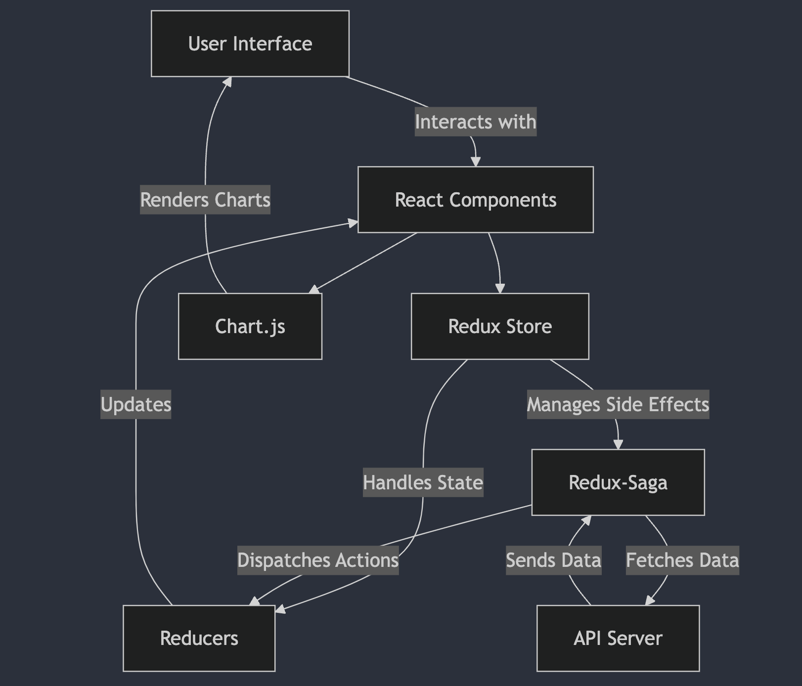

# Expense Management Dashboard

## Overview

This repository contains the frontend code for the Expense Management Dashboard, a web application designed to manage and visualize personal expenses. The application is built using React, Redux, and Redux-Saga, with Chart.js for data visualization.

## Features

- **Add and Edit Expenses**: Create new expenses and modify existing entries.
- **Filter and Sort**: Advanced filtering and sorting options for expenses.
- **Data Visualization**: Interactive charts displaying expenses by category and over time.
- **Export Functionality**: Export expenses to a CSV file.
- **Responsive Design**: Optimized for both desktop and mobile devices.

## Architecture

The application is structured following a modular architecture that separates concerns into different layers and components. The primary technologies and libraries used are:

- **React**: For building the user interface.
- **Redux**: For state management.
- **Redux-Saga**: For handling side effects and asynchronous actions.
- **Chart.js**: For rendering charts and visualizations.
- **React-Icons**: For scalable vector icons.


## Getting Started

### Prerequisites

- **Node.js**: Ensure you have Node.js and npm installed.
- **Git**: Git should be installed for cloning the repository.

### Installation

1. **Clone the Repository**

   ```bash
   git clone https://github.com/parita-akoliya/personal-expense-tracker-react.git
   cd personal-expense-tracker-react
   ```

2. **Install Dependencies**

   Use npm to install the required dependencies.

   ```bash
   npm install
   ```

### Running the Application

1. **Start the Development Server**

   Run the following command to start the React development server:

   ```bash
   npm start
   ```

   The application will be available at `http://localhost:3000`.

### Building for Production

To build the application for production, use the following command:

```bash
npm run build
```

This will create an optimized build of the application in the `build` directory.

### Testing

To run tests, use the following command:

```bash
npm test
```

### Usage

- **Add Expense**: Click the "Add Expense" button to open a modal for entering new expenses.
- **Edit Expense**: Click the edit icon next to an expense to modify its details.
- **Filter Expenses**: Use the search bar and filter options to refine the list of displayed expenses.
- **Export to CSV**: Click the "Export CSV" button to download expenses as a CSV file.

## Contributing

Contributions are welcome! Please fork the repository and submit a pull request for review.

## License

This project is licensed under the MIT License.

## Contact

For questions or support, please contact [your-email@example.com].